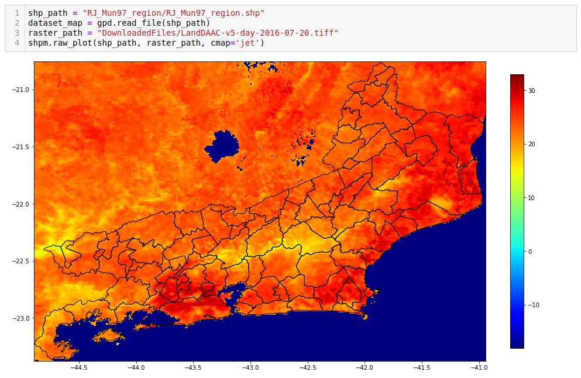
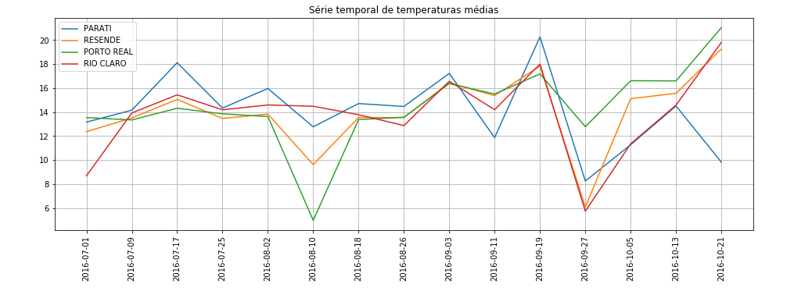

# Satelite Codes

The routines available in this package are designed to capture and process satellite images easily and conveniently. In addition, there are routines for combining raster data with shapefiles layers for more informative images. Check out the notebook [examples.ipynb](https://github.com/felipebottega/Satellite-Codes/blob/master/examples.ipynb) to see how it all works in details. Below we show the general structure of the sources to download the raster data.

## Requisites

To use all the features, you will need the following modules:

    numpy
    pandas
    geopandas
    glob
    gzip
    datetime
    imageio
    rasterio
    rasterstats
    shapely
    xarray
    netCDF4
    cartopy
    geoviews (version 1.6.2 or higher)
    celery
    rabbitmq-server
    flower
    earthengine-api
    pydrive
    
If you are using conda, I recommend to create an env for this package. The following steps worked for me:

1) Create your env with some packages.

        conda create -n satelite rasterio pandas geopandas imageio shapely xarray netCDF4 cartopy geoviews

2) Within this env, install the extra packages.

        conda install -c conda-forge rabbitmq-server   
        conda install -c conda-forge flower   
        conda install -c conda-forge rasterstats   
        conda install -c conda-forge earthengine-api
        conda install -c conda-forge pydrive
   
Geoviews is optional as it is responsible for only some visualization functions. If you want these features, then cartopy must be installed before geoviews. 

## Features

You can easily extract the bounding box of shapefiles, download the raster data of interest and them merge the raster and shapefile together. Not only the bounding box, but it is also possible to download a range of specified time. Additionally, there are options to treat the images, performing upsampling or downsampling.  

With minimum effort you can tell the program to compute the average (pixel) per polygon, make customized plots and visualize the temporal series of some chosen polygons.

Interactive sessions to visualize the time evolution of the raster data are available too. 

  

## Google Earth Engine

Some sources are available only with Google Earth Engine. To use it you need to install and authenticate, follow the instructions [here](https://developers.google.com/earth-engine/python_install-conda.html). All downloads automatically goes to your Google Drive, hence you also need to install pydrive and create an API, that way the program will be able to download from the Drive to your computer automatically. Follow the instructions [here](https://pythonhosted.org/PyDrive/quickstart.html). After these steps are done, the files `client_secrets.json`, `credentials.json` and `mycreds.txt` must be saved in the same place where the module **tiff_downloader** is located.   
